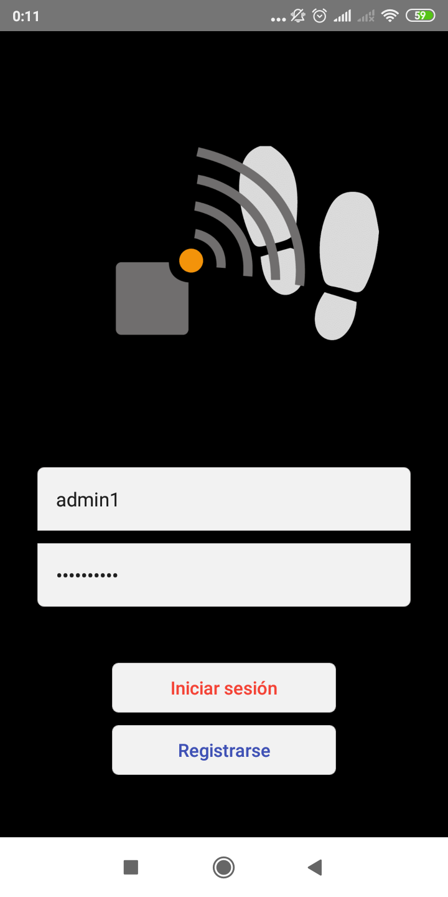
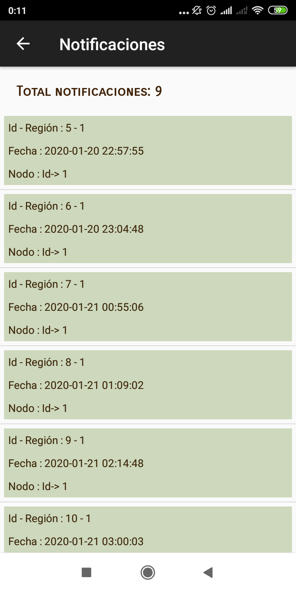
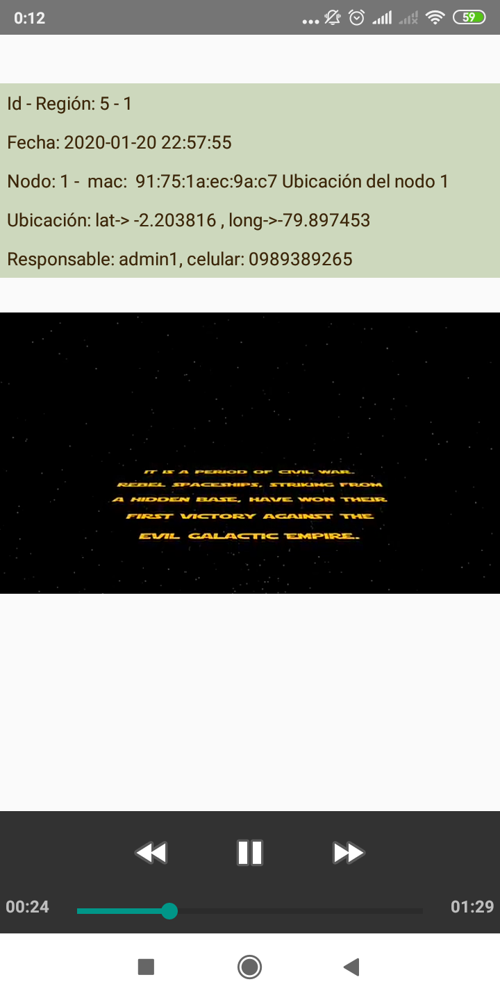
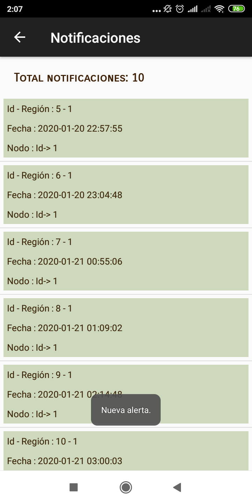
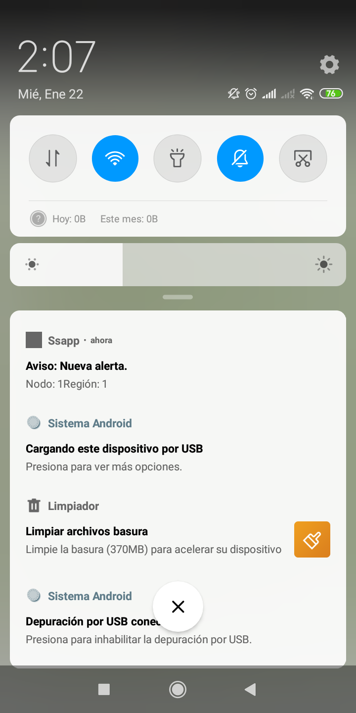

ProyectoRedesSensores
=====================

Version 1.0 22-01-2020
----------------------

La aplicación móvil administra una lista de nodos o áreas de monitoreo. En cada una de estas áreas se podrá obtener información del estado actual. De los últimos eventos y en caso de que exista algún evento, primero llegará una notificación del evento y luego se podrá obtener videos de la región donde se detectó algún tipo de movimiento. 

Capturas app
---------------------
1. Inicio de sesión

2. Lista de notificaciones/eventos

3. Visualización de una notificación/evento

4. Cuando llega una nueva alerta

Otros repositorios:
* Aplicación móvil. [github](https://github.com/vicbrodr21/ProyectoRedesSensores)
* Api del gateway.[github](https://github.com/bpovea/api_sensores_server)
* Nodo.[github](https://github.com/vicbrodr21/ProyectoRedesSensores)

----------------------------------
### Autores ###
* Victor Rodriguez [github](https://github.com/vicbrodr21)
* Mauricio Leiton [github](https://github.com/mdleiton)

